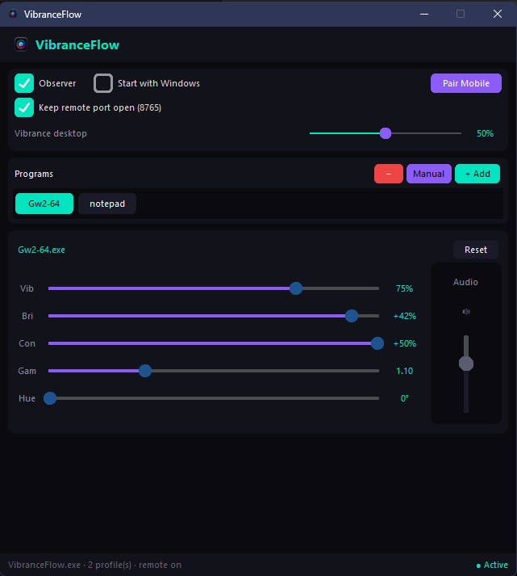
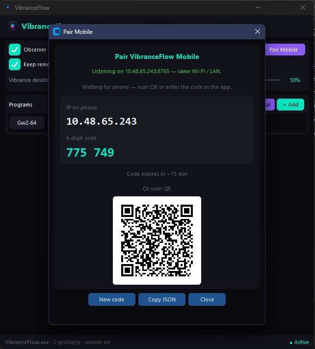
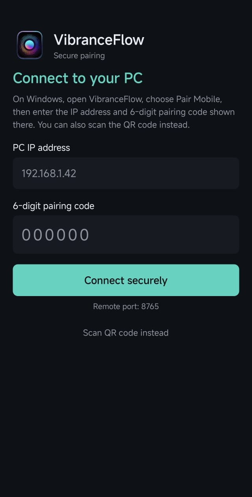
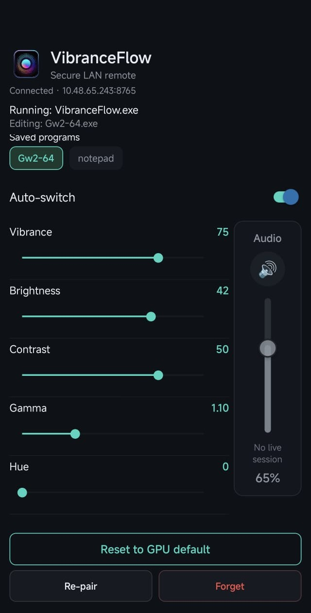

# 🌊 Welcome to the VibranceFlow Ecosystem

VibranceFlow is your ultimate tool to **automate your screen colors for every game and app**. 
Designed for gamers, designers, streamers, and casual users, it seamlessly adjusts Digital Vibrance, Gamma, Brightness, and Contrast on Windows. 

The ecosystem includes a fully standalone desktop app and an optional, powerful Android remote control-all built with a Zero-Trust architecture.

🌐 **[Official Website & Downloads](https://vibranceflow.vercel.app/)**

---

### 🎯 Who is this for?

* **🎮 Gamers:** Adjust contrast and gamma *in-game*. Control background music volume (Spotify, Discord) remotely without ever Alt-Tabbing.
* **🎨 Designers & Editors:** Easily alter saturation and contrast to test visual accessibility across different spectrums.
* **📺 Casual Users:** Turn your phone into a multimedia remote to control your PC's screen brightness, tone, and volume from the couch.
* **🎥 Streamers:** Dynamically switch screen color profiles on your main display without leaking settings on stream.

**Windows (standalone - no phone required)**

  
  &nbsp;&nbsp;
  

**Android (optional LAN remote)**

  
  &nbsp;&nbsp;
  

*Click any screenshot on GitHub to open it full size.*

---

### 📦 Our Repositories

The VibranceFlow architecture is split into three main modules:

* 🖥️ **[VibranceFlow-core](https://github.com/VibranceFlow/VibranceFlow-core)**
  The heart of the application for Windows. Handles background process monitoring and native Win32/NVAPI display calls with 0% CPU usage. Hosts the local WebSocket server.
  
* 📱 **[VibranceFlow-mobile](https://github.com/VibranceFlow/VibranceFlow-mobile)**
  The optional companion app for Android. Pairs via a local QR Code to remotely control your PC's display settings and audio on the fly.

* 🕸️ **[VibranceFlow-web](https://github.com/VibranceFlow/VibranceFlow-web)**
  The official landing page, built with Astro and Tailwind CSS for maximum speed and SEO performance.

---

### 🛡️ Security First

As a project built with a strict security mindset:
- **Zero Telemetry:** We do not track, collect, or send any analytics.
- **Local Network Only:** The mobile app communicates directly with the PC via local Wi-Fi. No cloud servers or accounts are required.
- **Transparent CI/CD:** Our release binaries (`.exe` and `.apk`) are built directly via GitHub Actions from the source code.

---

### ☕ Support the Development

To keep this project 100% free and to help us purchase official Developer Code Signing Certificates (to remove antivirus false positives), consider supporting the project:

*Contributions, bug reports, and feature requests are always welcome in their respective repositories!*
